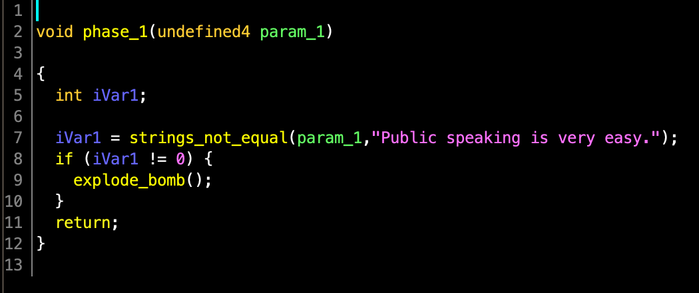
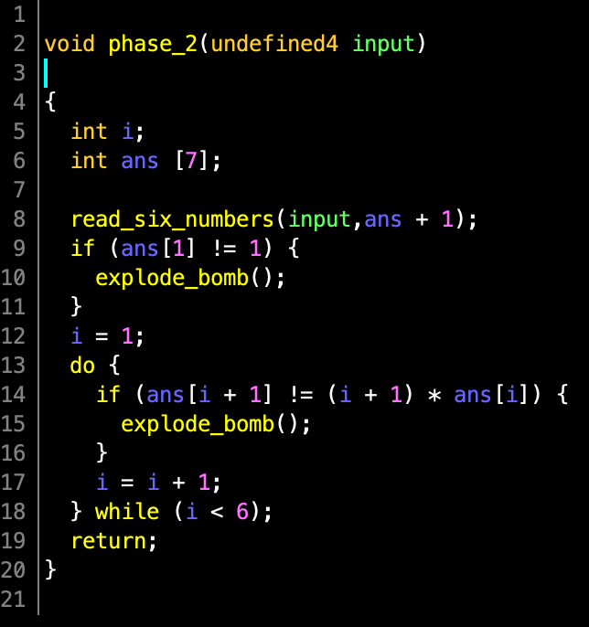
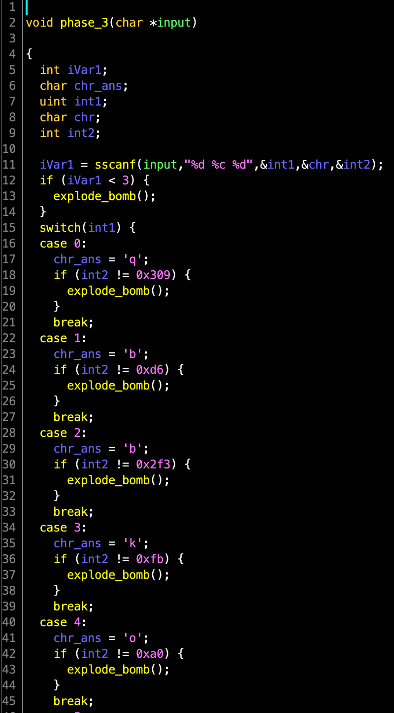
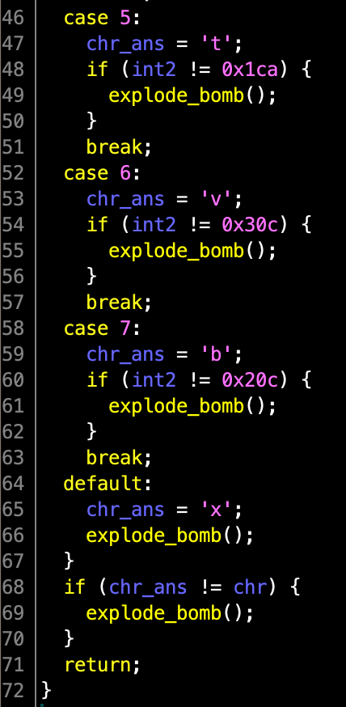
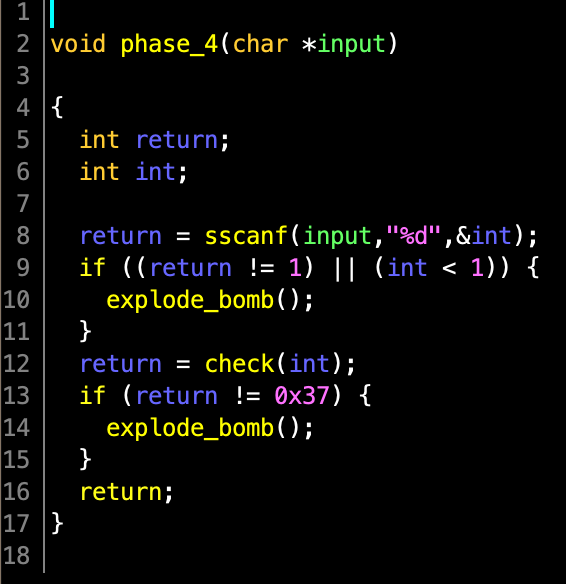
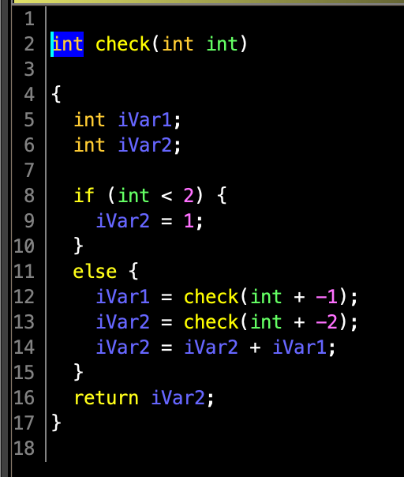

## Phase 1 (x86)

The CMU bomb lab is a famous reverse engineering challenge from CMU.
This category's challenges will track your progress through the 32-bit x86 CMU bomb lab.
Welcome to my fiendish little bomb. You have 6 phases with which to blow yourself up. Have a nice day!

## Writeup

In first phase, it compares the input `param_1` with `Public speaking is very easy.`, and if the it is not equal, it will explode the bomb. 
So the answer of first pharse is `Public speaking is very easy.`.

In second phase, it read 6 integer from the input using `sscanf`, then check if the first integer is 1. Afterwards, the `for` loop check the rest numbers to be `2!`, `3!` ... `6!`. 
So the anwser is `1 2 6 24 120 720`.

In third phase, it takes 2 integer (`int1`, `int2`) and 1 character (`chr`) from the input using `sscanf`. For each `int` from 0 to 7, it requires the corresponded `chr_ans` and `int2` to defuse the bomb. I chose the first pair of answer.
The answer can be `0 q 777`.

In forth phase, it reads 1 integer `int`, then check if the return of the `check(int)` is `0x37`. `check()` is a recursive function:

=%5Cbegin%7Bcases%7D1&,n%20%3C%202%5C%5Ccheck(n-1)&plus;check(n-2)&,o.w.%5Cend%7Bcases%7D%20)

I wrote the script `phase4.py` to find the answer, which is `9`.

